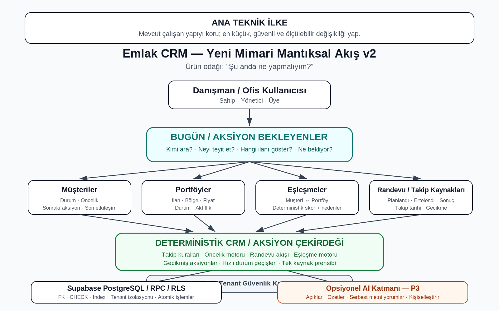

# PROJE KARARLARI

---

## 1. Ürün Kararları

### Ürün Amacı

Emlakçının müşteriyi, portföyü, randevuyu ve geri dönüşü unutmasını önleyen; bugün ne yapması gerektiğini net biçimde söyleyen sade bir emlak CRM / günlük satış asistanı.
Ana ürün vaadi:

> “CRM sana sadece kayıt tutturmuyor; bugün kiminle ilgilenirsen satış ihtimalin daha yüksek, onu söylüyor.”

Ürün klasik bir kayıt yönetim sistemi olmaktan çok, emlakçının günlük iş akışını yönlendiren bir yardımcı olmalıdır.

---

### Sistemin Ana Sorusu

Ürünün cevaplaması gereken temel soru:

> “Şu anda ne yapmalıyım?”

Bunun müşteri tarafındaki en önemli karşılığı:

> “Bugün kimi ararsam satış ihtimalim daha yüksek?”

Sistem; müşteri, portföy, randevu, takip, görev ve etkileşim verilerini bu sorulara hizmet edecek şekilde düzenlemelidir.

---

## 2. Ana Ürün Deneyimi

### Aksiyon Bekleyenler

Ürünün ana çalışma modeli klasik görev listesi değildir.

Ana deneyim:

> **Aksiyon Bekleyenler**

Sistem, emlakçının ilgilenmesi gereken kayıtları tek bir öncelikli akışta toplar.

Bu akışta örnek olarak şunlar bulunabilir:

- yeni müşteri
- süresi gelen müşteri takibi
- ulaşılamayan müşteri
- yaklaşan randevu
- geçmiş fakat sonucu girilmemiş randevu
- ertelenmiş randevu
- güçlü müşteri–ilan eşleşmesi
- yeni portföyle eşleşen müşteri
- uzun süredir temas edilmeyen sıcak müşteri

Amaç kullanıcının farklı ekranlarda kayıt araması değil, sistemin doğru işi doğru zamanda önüne getirmesidir.

---

### Ana UX İlkesi

Emlakçı mümkün olduğunca:

> **planlama yapmamalı, sonucu işaretlemelidir.**

Örnek sonuçlar:

- Ulaşamadım
- Görüştüm
- Randevu oluştu
- Görüşüldü
- Ertelendi
- İptal
- İlan gösterildi
- Teklif verildi
- İlgilenmiyor

Bu sonuçlardan sonraki aksiyon sistem tarafından mümkün olduğunca otomatik belirlenmelidir.

---

### Minimum Veri Girişi

Ürün kullanıcıdan gereksiz veri istememelidir.

Sistem mümkün olduğunca mevcut verilerden yararlanır:

- müşteri bilgileri
- müşteri tercihleri
- önceki görüşmeler
- son etkileşim zamanı
- randevu tarihi ve saati
- görev / takip geçmişi
- müşteri–ilan eşleşmeleri
- portföy bilgileri
- randevu durumu

Kullanıcıdan yalnızca olayın sonucunu veya gerçekten bilinmesi gereken yeni bilgiyi istemek tercih edilir.

Örnek:

Müşteriyle görüşüldüyse kullanıcıya yeni görev formu açılmaz.

Kullanıcı sadece:

> Görüştüm

der.

Sistem:

- son etkileşimi günceller
- müşteri önceliğini günceller
- gerekiyorsa sonraki takip tarihini oluşturur
- zamanı geldiğinde müşteriyi yeniden Aksiyon Bekleyenler'e getirir

---

### Mobil Kullanım İlkesi

Ürün özellikle telefon kullanımında küçük form alanları ve çok sayıda seçenekle kullanıcıyı yormamalıdır.

Normal işlemler mümkün olduğunca:

> **1–2 dokunuşta tamamlanmalıdır.**

Tarih, saat, öncelik ve detay alanları yalnızca gerektiğinde gösterilmelidir.

Örneğin:

**Randevu kartı**

Ahmet Yılmaz  
Bugün 14:30

Aksiyonlar:

- Ara
- WhatsApp
- Görüşüldü
- Ertele
- İptal

`Ertele` seçilmediği sürece tarih/saat seçici açılmamalıdır.

---

## 3. Sistem Önerir, Kullanıcı Gerekirse Düzeltir

Varsayılan yaklaşım:

> **Sistem önerir → kullanıcı gerekirse değiştirir.**

Örneğin:

- Ulaşamadım → varsayılan olarak yarın tekrar ara
- Görüştüm → varsayılan olarak birkaç gün sonra takip
- Randevu oluştu → randevu öncesi teyit
- Randevu geçti → sonucu sor
- Yeni güçlü eşleşme → ilanı göster
- Uzun süredir temas yok → tekrar gündeme getir

Ancak kullanıcı özel bir durum varsa varsayılanı değiştirebilmelidir.

Örnek:

Müşteri:

> “Beni iki hafta sonra ara.”

derse emlakçı varsayılan takip tarihini değiştirebilir.

---

## 4. Öncelik Motoru

Başlangıç öncelik sırası:

1. Yeni gelen müşteri
2. Yeni portföyle güçlü eşleşen müşteri
3. Yaklaşan / sonucu bekleyen randevu
4. Randevu sonrası geri dönüş bekleyen müşteri
5. Gecikmiş sıcak müşteri
6. Süresi gelen normal takip
7. Uzun süredir temas edilmeyen müşteri
8. Soğuk müşteri

Bu sıra başlangıç iş kuralıdır.

Gerçek kullanım verisine göre daha sonra puanlama geliştirilebilir.

İlk aşamada puanlama deterministik olmalıdır.

---

## 5. Ana Bölümler

Ürünün kullanıcıya görünen temel bölümleri mümkün olduğunca sınırlı tutulur.

Ana bölümler:

- Bugün / Aksiyon Bekleyenler
- Müşteriler
- Portföyler
- Eşleşmeler

Görevler, randevular, AI, WhatsApp ve Instagram ayrı birer ürün gibi büyütülmez.

Bunlar mümkün olduğunca ilgili müşteri, portföy veya aksiyon akışının içinde kullanılır.

---

## 6. Görevler ve Takipler

`gorevler` tablosu teknik altyapıda kullanılabilir.

Ancak kullanıcıya klasik görev yönetim sistemi gibi sunulmamalıdır.

Görev altyapısının amacı:

- sonraki müşteri takibini saklamak
- gecikmiş işlemleri bulmak
- Aksiyon Bekleyenler kuyruğunu beslemek
- geçmiş aksiyonları takip etmek

Kullanıcı tarafında ürün dili “görev yönetimi” yerine mümkün olduğunca:

- aksiyon
- takip
- sıradaki işlem
- ilgilenilecek müşteri

mantığına yakın olmalıdır.

---

## 7. Randevu Deneyimi

Randevu yalnızca kayıt olarak tutulmamalı, aksiyon üretmelidir.

Randevu durumları örnek olarak:

- planlandı
- gerçekleşti
- ertelendi
- iptal

Yaklaşan randevu Aksiyon Bekleyenler'de görünmelidir.

Randevu kartından mümkün olduğunca doğrudan:

- Ara
- WhatsApp
- Görüşüldü
- Ertele
- İptal

işlemleri yapılabilmelidir.

Randevu ertelendiğinde kullanıcı müşteriyi tekrar bulmak zorunda kalmamalıdır.

Sistem mevcut randevuyu doğrudan güncellemelidir.

Randevu zamanı geçtiği halde sonuç girilmediyse sistem:

> “Randevu sonucu girilmedi.”

şeklinde tekrar aksiyon oluşturmalıdır.

---

## 8. Müşteri–Portföy Eşleşmesi

Müşteri–ilan eşleşmesi ilk fazda deterministik çalışmalıdır.

Temel kriterler:

- ilan tipi
- bütçe
- ilçe
- mahalle
- oda sayısı
- metrekare

Aktif olmayan ilanlar eşleşmeye dahil edilmez.

Müşterinin ilan tercihi mevcutsa yanlış ilan tipi eşleşmeye dahil edilmez.

Eksik müşteri kriterleri ücretsiz puan üretmemelidir.

Eşleşme puanı ve eşleşme nedenleri backend / SQL tarafında hesaplanmalıdır.

Frontend ayrı bir eşleşme algoritması taşımamalıdır.

Tek kaynak prensibi uygulanmalıdır.

Güçlü eşleşme yalnızca rapor olarak gösterilmemeli, gerektiğinde aksiyona dönüşmelidir.

Örnek:

> “Bu müşteriye yeni uygun ilan bulundu.”

Aksiyon:

- İlanı Göster
- WhatsApp
- Sonra Hatırlat

---

## 9. Müşteri Merkezli Çalışma

Her müşterinin mümkün olduğunca şu bilgileri net olmalıdır:

- mevcut durum
- sıcaklık / öncelik
- sonraki aksiyon
- sonraki aksiyon tarihi
- son etkileşim zamanı
- ilgili portföyler
- randevu geçmişi
- takip geçmişi
- gösterilen ilanlar
- teklif geçmişi
- sorumlu kullanıcı / ofis

Aksiyon Bekleyenler ekranı bu verilerden üretilmelidir.

---

## 10. AI Kullanım Kararı

### İlk Faz

İlk fazda AI ürünün çekirdeğinde kullanılmayacaktır.

Çekirdek CRM:

> **AI olmadan tam çalışmalıdır.**

İlk fazda şu işler deterministik kurallarla çözülür:

- müşteri önceliklendirme
- bugün aranacak müşteriler
- takip tarihi oluşturma
- randevu akışı
- randevu çakışma kontrolü
- müşteri–ilan eşleşmesi
- gecikmiş aksiyonlar
- geçmiş randevu sonucu
- güçlü eşleşmenin aksiyona dönüştürülmesi

Basit `if/else`, SQL ve iş kurallarıyla çözülebilecek işler için AI maliyeti oluşturulmaz.

---

### AI'nın Gelecekteki Rolü

AI daha sonra verimlilik ve yorumlama katmanı olarak eklenebilir.

AI şu alanlarda değer üretebilir:

- serbest metin müşteri notlarını anlamlandırma
- görüşme notlarını özetleme
- müşteri niyetini yorumlama
- kişiselleştirilmiş mesaj önerisi
- müşteri–ilan eşleşmesini doğal dille açıklama
- istisnai durumlarda sonraki aksiyon önerisi
- “neden bugün ara?” açıklaması
- satış temsilcisine kişiselleştirilmiş öneri

AI sistemin icra katmanı değildir.

Örnek:

AI:

> “Bu müşteriyi yarın aramak mantıklı.”

Sistem:

- yetkiyi kontrol eder
- tarihi doğrular
- takip kaydını oluşturur

---

### AI'nın Yapmaması Gerekenler

AI:

- temel CRM akışını kendisine bağımlı hale getirmemeli
- tenant güvenliğine karar vermemeli
- veritabanı bütünlüğünü yönetmemeli
- randevu çakışmasını tek başına değerlendirmemeli
- kayıt silme/güncelleme yetkisini belirlememeli
- frontend'de gizli API anahtarı kullanmamalı
- doğrulanmamış AI çıktısını gerçek veri gibi kaydetmemeli
- her ekran açılışında otomatik maliyet üretmemeli

AI başarısız olduğunda çekirdek CRM çalışmaya devam etmelidir.

---

## 11. Ürün Konumlandırması

Rakiplerle yarışma stratejisi:

> **Daha fazla özellik değil, daha az sürtünme.**

TapyPro ve benzeri ürünler şu alanlarda güçlüdür:

- müşteri takibi
- müşteri–portföy eşleşmesi
- satış pipeline
- hatırlatmalar
- ekip yönetimi
- geniş CRM özellikleri

Bizim farkımız yalnızca bu özelliklere sahip olmak değildir.

Farkımız:

- daha az form
- daha az menü
- daha az manuel planlama
- daha az kayıt arama
- daha fazla otomatik aksiyon
- daha fazla tek dokunuşlu işlem
- mobil kullanım kolaylığı
- “şimdi ne yapmalıyım?” sorusuna doğrudan cevap

Ürün yönü:

> **“Emlakçının CRM'i değil, günlük satış asistanı.”**

Rakiplerin yaptığı özellikleri körü körüne çoğaltmak yerine kullanıcının günlük iş yükü hedeflenir.

---

## 12. Ürün Başarı Ölçütleri

Ürünün işe yarayıp yaramadığı yalnızca özellik sayısıyla ölçülmez.

Takip edilmesi gereken temel ürün metrikleri:

- bir aksiyonun kaç dokunuşta tamamlandığı
- manuel tarih / saat giriş oranı
- takipsiz kalan müşteri sayısı
- gecikmiş takip sayısı
- sonucu girilmemiş randevu sayısı
- güçlü eşleşmelerden gösterime dönüşenlerin oranı
- gösterimden teklife dönüşüm
- yeni müşteriye ilk temas süresi
- günlük tamamlanan aksiyon sayısı

Ana UX hedefi:

> Normal işlemlerin büyük çoğunluğu 1–2 dokunuşta tamamlanmalıdır.

---

# 13. Teknik Mimari Kararları

## Temel Veri Yapısı

Ana tablolar:

- ofisler
- ofis_uyeleri
- musteriler
- ilanlar
- randevular
- gorevler
- musteri_ilan_etkilesimleri
- ai_analizler

Temel ilişki:

> Ofis → Kullanıcı → Müşteri / Portföy → Randevu / Takip / Etkileşim

AI verileri çekirdek veri modelinin dışında ek katmandır.

---

## 14. Deterministik Çekirdek

Ana iş kuralları mümkün olduğunca PostgreSQL / SQL / RPC katmanında uygulanır.

Örnekler:

- bugün aranacak müşteri
- aksiyon önceliği
- sonraki takip
- randevu oluşturma
- randevu çakışması
- müşteri–ilan eşleşmesi
- ofis erişimi
- veri bütünlüğü

Frontend iş kuralının ikinci bir kopyasını taşımamalıdır.

Aynı iş kuralı birden fazla yerde tekrar edilmemelidir.

Tek kaynak prensibi tercih edilir.

---

## 15. Aksiyon Motoru

Uzun vadeli ana backend yapısı:

> `aksiyon_bekleyenler`

mantığıdır.

Bu katman farklı veri kaynaklarını tek kuyrukta birleştirebilir:

- müşteriler
- takipler / görevler
- randevular
- müşteri–ilan eşleşmeleri
- geçmiş etkileşimler

İlk fazda event bus, message queue veya ağır worker mimarisi kurulmaz.

PostgreSQL + RPC mevcut ihtiyaç için yeterlidir.

Zaman bazlı aksiyonlar ilk aşamada sorgu sırasında hesaplanabilir.

Gerçek background scheduler yalnızca ihtiyaç oluşursa eklenir.

---

## 16. Ofis / Tenant İzolasyonu

Her ana iş tablosu ofis bağlamında çalışır.

Kullanıcı yalnızca üyesi olduğu ofisin verilerine erişebilir.

RLS temel veri güvenliği katmanıdır.

`USING (true)` / `WITH CHECK (true)` ile global authenticated erişim bırakılmaz.

Cross-office ilişki kurulmasına izin verilmez.

Normal istemciler tenant sınırını aşamaz.

MVP'de kullanıcı tek ofise bağlıdır.

---

## 17. Auth ve Yetki

Roller:

- sahip
- yonetici
- uye

Kurallar:

- görüntüleme ve düzenleme ofis üyeliğine göre yapılır
- kritik silme / yönetim işlemleri role göre sınırlandırılır
- normal üyeye gereksiz geniş yetki verilmez
- SECURITY DEFINER fonksiyonları minimum yetkiyle çalışır
- PUBLIC / anon execute yetkileri açık bırakılmaz

---

## 18. SECURITY DEFINER / RPC Güvenliği

Fonksiyonlarda mümkün olduğunda:

- `SECURITY INVOKER` tercih edilir
- SECURITY DEFINER yalnızca gerçekten gerektiğinde kullanılır
- `search_path` açıkça belirlenir
- PUBLIC execute kapatılır
- anon execute kapatılır
- authenticated için yalnızca gerekli fonksiyonlara izin verilir

Fonksiyonlar tenant sınırını aşamaz.

---

## 19. Storage

İlan fotoğrafları Supabase Storage kullanabilir.

Public read ürün ihtiyacına göre açık olabilir.

Upload / update / delete yalnızca yetkili authenticated kullanıcıya açık olur.

Başka ofisin ilan fotoğrafı değiştirilemez veya silinemez.

Storage yolu ofis izolasyonuna uygun tutulur.

Tercih edilen yapı:

> `<ofis_id>/ilanlar/<dosya>`

Legacy dosyalar sessizce taşınmaz.

---

## 20. Veri Bütünlüğü

Veritabanı yalnızca veri saklamaz; hatalı ilişkiyi de engeller.

Kontrol edilmesi gereken başlıca kurallar:

- bütçe min/max mantığı
- m² min/max mantığı
- geçersiz tarih/saat
- randevu çakışması
- geçersiz durum değerleri
- geçersiz rol değerleri
- geçersiz aksiyon değerleri
- cross-office müşteri ilişkisi
- cross-office ilan ilişkisi
- cross-office randevu ilişkisi
- cross-office görev ilişkisi
- duplicate kayıtların kontrollü yönetimi
- gerekli foreign key
- gerekli unique constraint
- gerekli check constraint

---

## 21. Randevu Bütünlüğü

Randevu oluşturma mümkün olduğunca atomik yapılır.

Aynı ofiste aynı tarih ve saatte planlanmış randevu bulunması kontrol edilir.

Takip sonucundan randevu oluşuyorsa:

- müşteri güncellemesi
- ilgili takip değişikliği
- randevu oluşturma

tek transaction içinde gerçekleştirilmelidir.

İşlem başarısız olursa yarım kayıt bırakılmamalıdır.

---

## 22. Performans

Indexler gerçek sorgulara göre tasarlanır.

Öncelikli sorgular:

- ofis bazlı sorgular
- Aksiyon Bekleyenler
- bugün aranacak müşteriler
- açık / gecikmiş takipler
- yaklaşan randevular
- müşteri–ilan eşleşmeleri
- müşteri geçmişi
- ilan geçmişi
- etkileşim geçmişi

Gereksiz tek kolon indexleri yerine ihtiyaca göre composite veya partial index tercih edilir.

---

## 23. Migration Stratejisi

Uygulanmış migration dosyaları değiştirilmez.

Yeni değişiklikler yeni migration ile yapılır.

Migration geçmişi append-only kabul edilir.

Yeni migration:

- veri silmemelidir
- legacy veriyi sessizce dönüştürmemelidir
- tehlikeli backfill yapmamalıdır
- tenant sınırlarını bozmamalıdır
- production'a uygulanmadan önce dry-run yapılmalıdır

Riskli backfill işlemleri kullanıcı çağrılı RPC içine konmaz.

Production'a uygulanmadan önce migration ayrıca gözden geçirilir.

---

## 24. Production Değişiklik İlkesi

Production etkili işlemlerde sıralama:

1. mevcut durumu kontrol et
2. riski değerlendir
3. en küçük değişikliği hazırla
4. local migration oluştur
5. diff / SQL kontrolü yap
6. dry-run çalıştır
7. kullanıcı onayı
8. production push
9. davranışı doğrula

Destructive işlem varsayılan değildir.

---

## 25. Geliştirme Stratejisi

Varsayılan akış:

1. Analiz et
2. Problemi sınıflandır
3. En küçük güvenli değişikliği seç
4. Gerekirse schema / veri yapısını kontrol et
5. Aider'a dar görev ver
6. Diff kontrol et
7. TypeScript / ESLint / build çalıştır
8. Davranışı test et
9. Sonraki göreve geç

Büyük refactor yasak değildir.

Ancak yalnızca açık, ölçülebilir faydası varsa yapılır.

---

## 26. Aider Kullanım Kuralı

Aider:

- geniş kapsamlı analiz yapabilir
- kod değişikliklerini küçük ve doğrulanabilir adımlarla uygular
- mümkün olduğunca yalnızca belirtilen dosyalara dokunur
- uygulanmış migration geçmişini yeniden yazmaz
- `.env`, API key, service role key gibi secret'lara dokunmaz
- destructive SQL çalıştırmaz
- production etkili Supabase komutlarını kullanıcı adına otomatik çalıştırmaz
- büyük refactor'u açık talep olmadan yapmaz

Aider otomatik commit atarsa commit ayrıca kontrol edilir.

---

## 27. Doğrulama

Her anlamlı değişiklikten sonra mümkün olduğunca:

- `git diff`
- `git status`
- build
- TypeScript kontrolü
- migration dry-run
- gerçek kullanıcı akışı testi

yapılır.

Bilinen bağımsız hatalar yeni değişikliğin hatası gibi değerlendirilmez.

Build uyarıları ile gerçek build hataları birbirinden ayrılır.

---

## 28. Öncelik Seviyeleri

### P0 — Güvenlik / Veri Kaybı

- tenant / ofis izolasyonu
- RLS
- Storage yetkileri
- SECURITY DEFINER
- yanlış ofise veri bağlama
- anon erişimi
- veri silme riski
- cross-office veri bütünlüğü

### P1 — CRM Çekirdeği

- Aksiyon Bekleyenler
- Bugün ekranı
- sonraki aksiyon
- sonraki aksiyon tarihi
- müşteri öncelik motoru
- müşteri–portföy eşleşmesi
- randevu oluşturma
- randevu erteleme
- randevu sonrası takip
- geçmiş randevu sonucu
- hızlı aksiyonlar

### P2 — Veri Kalitesi / Performans

- indexler
- constraint'ler
- duplicate kontrolü
- veri tipleri
- sorgu optimizasyonu
- aksiyon kuyruğu performansı
- mobil UX iyileştirmeleri

### P3 — Entegrasyon / İleri Özellikler

- WhatsApp
- Instagram
- ilan paylaşımı
- otomasyonlar
- AI iyileştirmeleri
- AI destekli açıklamalar
- AI destekli serbest metin analizi

---

## 29. Ana Ürün İlkesi

Her yeni özellik için şu soru sorulur:

> “Bu özellik emlakçının daha hızlı satış yapmasına, müşteriyi unutmamasına, doğru portföyü daha hızlı bulmasına veya takibi daha kolay yapmasına yardım ediyor mu?”

Cevap net değilse özellik öncelikli değildir.

---

## 30. Ana UX İlkesi

Her yeni ekran ve işlem için şu soru sorulur:

> “Emlakçı bunu telefonda koştururken rahatça kullanabilir mi?”

Normal bir işlem:

- müşteri aratmayı
- farklı menülere gitmeyi
- gereksiz form doldurmayı
- tekrar tekrar aynı bilgiyi girmeyi

gerektiriyorsa akış yeniden tasarlanmalıdır.

---

## 31. Ana Teknik İlke

Mevcut çalışan yapıyı koruyarak mümkün olan en küçük, güvenli ve ölçülebilir değişiklik yapılır.

Güvenlik veya veri bütünlüğü sorunu varsa gerekli Supabase / RLS / Storage / Auth / schema değişiklikleri yapılabilir.

Ancak:

- önce etkisi analiz edilir
- yeni migration ile uygulanır
- production öncesi doğrulanır
- mümkün olduğunca geri alınabilir ve atomik tutulur

---

## 32. Nihai Ürün Yönü

Ürün yalnızca kayıt tutan bir CRM olmayacaktır.

Hedef:

> Müşterileri, portföyleri, randevuları ve takipleri arkada düzenleyen; emlakçıya önde yalnızca sıradaki doğru işi gösteren günlük satış asistanı.

Kullanıcı sisteme hizmet etmemelidir.

> **Sistem kullanıcıya hizmet etmelidir.**